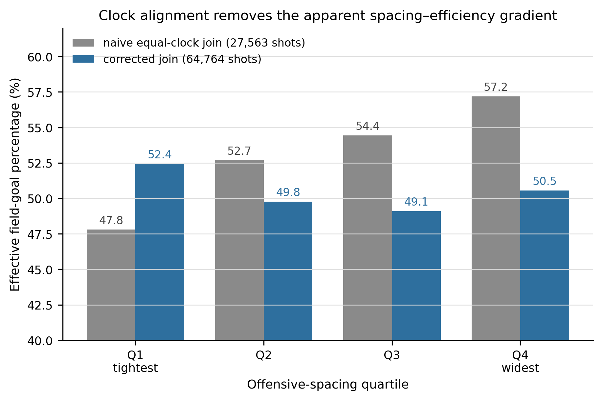
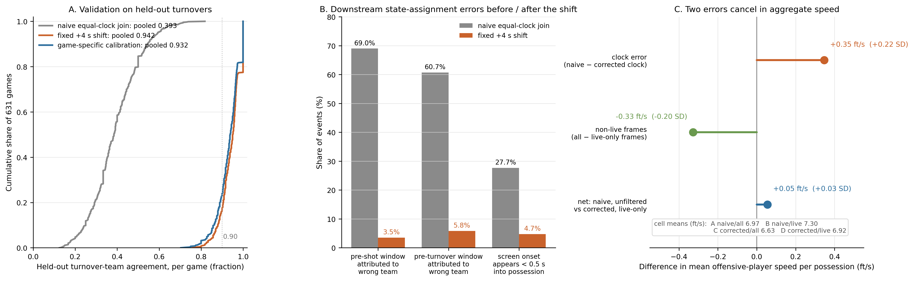

# Same Clock, Wrong Play
### Auditing NBA Tracking–Play-by-Play Alignment

Joining player-tracking frames to play-by-play events at equal game-clock values can map an event to the wrong basketball state — and the aggregate statistics computed from that join still look plausible. This repository contains the season-scale audit of that failure in the public 2015-16 NBA SportVU corpus, the corpus-specific correction we recommend, and the code, configurations and aggregate artifacts needed to check both.

> **Scope.** Everything here concerns the public 2015-16 SportVU / play-by-play pairing. Nothing is claimed for other seasons, other tracking providers (Second Spectrum, Hawk-Eye), other leagues or other sports.

## Why this matters

In this corpus, an equal-clock join puts the two-second window before a shot on the **wrong team 69.0 %** of the time. The error is large enough to produce an apparent basketball relationship: in the full eligible samples, effective field-goal percentage appears to rise from 47.8 % in the tightest offensive-spacing quartile to 57.2 % in the widest under the naive equal-clock join (27,563 shots), whereas the corrected quartiles are 52.4 / 49.8 / 49.1 / 50.5 % (64,764 shots) and the monotonic gradient does not survive.

A routine sanity check does not catch it. Clock misalignment inflates mean offensive-player speed by **+0.22 SD** while stopped-clock (dead-ball) frames deflate it by **−0.20 SD**, so a naive, unfiltered pipeline lands within **0.03 SD** of the fully corrected value. Aggregate plausibility does not establish event-level validity.

## Prior work

The scorer-latency phenomenon — play-by-play timestamps lagging the tracking clock — was first demonstrated on 10 games by the [**ismayc/tracking-study**](https://github.com/ismayc/tracking-study) repository (commit `d21f8e3c`), which also introduced the shot-based offset calibration, the idea of holding turnovers out as validation, and the spacing/eFG artifact example. We reproduced that work exactly before extending it (`docs/validation/EXTERNAL_REPLICATION.md`, `docs/validation/EXTERNAL_SOURCE_METHOD.md`). **This repository applies and extends that strategy to the season-scale corpus**: 632 public game files, of which 631 contain usable moments and are calibratable; held-out validation at scale, a per-game uncertainty taxonomy, an audit of downstream state assignment, a live-play layer and a reproducible correction resource.

## Corpus-specific correction

For the public 2015-16 SportVU corpus (632 game files, 631 calibratable) joined to stats.nba.com PlayByPlayV3:

```
tracking_clock = pbp_clock + 4.0     # seconds; the period clock counts down
```

1. **Do not join play-by-play and tracking at equal game-clock values.**
2. **Add +4.0 s to the play-by-play clock before selecting tracking frames.**
3. Treat games labelled `MULTIMODAL` (19.0 % of games) or `DRIFTING` (10.6 %) in `results/taxonomy_by_game.csv` as lower confidence.
4. Filter stopped-clock frames before computing movement metrics (`configs/LIVE_PLAY_CLASSIFIER.yaml`).

A fixed +4 s shift performed **at least as well as game-specific calibration** on held-out turnovers, in every curve class — the practical correction is a constant, not a per-game model.

> **Do not assume +4 s transfers.** The constant is a property of this corpus. The transferable part is the procedure: calibrate on one event class, validate on a different, held-out one, and publish the uncertainty with the correction.

## Main findings

| quantity | naive equal-clock join | fixed +4 s | game-specific calibration | artifact |
|---|---|---|---|---|
| held-out turnover-team agreement (16,943 turnovers never used to choose an offset; 631 games) | 0.393 | **0.942** | 0.932 | `results/global_shift_summary.json` |
| pre-shot 2-s window attributed to the wrong team | 69.0 % | **3.5 %** | 2.4 % | `results/global_shift_summary.json` |
| detected on-ball screens moved to a different possession (7,625 screens, 301 games) | — | 23.0 % | 23.9 % | `results/global_shift_screens.json` |
| screen onsets appearing < 0.5 s into the possession | 27.7 % | 4.7 % | 4.5 % | `results/global_shift_screens.json` |
| mean offensive speed: clock error / stopped-clock frames / net, in SD units | +0.22 / −0.20 / +0.03 | | | `results/temporal_semantic_2x2.json` |

**Supporting check — is the eFG artifact a measurement effect or a sample effect?** On the **26,177 shots common to both alignments**, the naive gradient is intact and monotone (Q1 0.485 → Q4 0.577, +9.2 points) while the corrected pattern is non-monotonic with a Q4–Q1 difference of only 0.3 points (0.546 / 0.515 / 0.530 / 0.549). The apparent spacing–efficiency relationship is a property of the join, not of which shots survive it (`docs/validation/MATCHED_SHOT_VALIDATION.md`). This is a supporting check: the primary result and Figure 1 use the full eligible samples (27,563 naive / 64,764 corrected). We read the corrected pattern only as evidence that the strong monotonic naive gradient is not robust to proper alignment (`docs/validation/FIGURE1_QUARTILE_NOTE.md`).

## Reproduction

Two levels; details and the exact boundary in `docs/REPRODUCIBILITY.md` and `docs/FRESH_CLONE_TEST.md`.

**Level 1 — from the shipped aggregates, no external data (seconds):**

```bash
pip install -r requirements.txt
python3 tests/test_smoke.py
```

regenerates both figures into `tests/_out/` and asserts every headline number against `results/`.

**Level 2 — from the public sources you obtain yourself:**

```bash
export SPORTVU_JSON_DIR=<directory with the 632 public mirror JSON files>
export PBP_PARQUET=<PlayByPlayV3 parquet for 2015-16>
bash scripts/run_all.sh
```

runs ingest → de-duplication → shot calibration → held-out turnover validation → curve taxonomy → the global-shift comparison → figures. A deterministic 25-game subset check (`src/fresh_clone_subset.py`) reproduced the shipped per-game leads, quality statuses and agreement rates exactly. Stages that need intermediate tables we do not redistribute (screen detections, possession inventories, live-play segment tables) are marked in `docs/REPRODUCIBILITY.md`; their producers are included.

## Data availability

Raw tracking and play-by-play are **not redistributed here**; we have not established a rights basis for republishing the third-party corpus (`docs/DATA_AVAILABILITY.md`, `docs/PROVENANCE.md`). The repository contains complete code, the analysis configurations, per-game scalar alignment metadata, aggregate validation statistics, the figure-ready aggregates and deterministic reconstruction instructions. No frame-, event-, possession- or player-level derived table is included.

## Per-game quality labels

`results/clock_alignment_v1.csv` — one row per game: calibrated lead, quality class, shot and turnover agreement counts, plateau width, half-game drift. `results/taxonomy_by_game.csv` — the class label (`SHARP_UNIMODAL` 22.5 %, `FLAT_PLATEAU` 47.8 %, `MULTIMODAL` 19.0 %, `DRIFTING` 10.6 %, `INSUFFICIENT` 0.2 %). The labels say how well identified the offset is in a given game; they are **not** evidence that game-specific calibration is better (`docs/QUALITY_LABELS.md`).

## Live-play filtering

Inside play-by-play-segmented possessions, **14.7 %** of tracking frames are stopped-clock frames and 39 % of possessions contain at least one. The classifier (`configs/LIVE_PLAY_CLASSIFIER.yaml`, producer `src/build_segments.py`) labels each frame live or non-live from clock and event semantics, never from player movement; prevalence and the effect on generic movement metrics are in `docs/validation/LIVE_PLAY_PREVALENCE.md` and `docs/validation/MOVEMENT_DISTORTION.md`. Filter these frames before computing speed, spacing or dispersion.

## Repository structure

```
src/            producers: calibration engine, global-shift comparison, temporal x live-play
                design, downstream consequences, live-play segmentation, matched-shot
                comparison, figures
configs/        analysis definitions (global-shift comparison, 2x2 design, curve classes,
                consequence metrics, live-play classifier, matched-shot comparison)
scripts/        run_all.sh — the user-supplied-source reproduction path
results/        per-game scalar tables and aggregate results (JSON/CSV)
figures/        the two figures (PDF + 300-dpi PNG) with captions
docs/           data availability, provenance, reproducibility, quality labels, limitations,
                the abstract
docs/validation/ method and validation notes behind each reported quantity
tests/          smoke test (figures + headline numbers from the shipped aggregates)
```

## Figures



*Figure 1 — the monotonic spacing–efficiency gradient produced by an equal-clock join (27,563 shots) does not survive clock correction (64,764 shots); the matched-shot check on 26,177 common shots is reported separately. Full caption: `figures/FIG1_naive_vs_corrected_spacing_efg.caption.txt`.*



*Figure 2 — held-out validation, wrong-state attribution before and after the shift, and the two offsetting speed errors. Full caption: `figures/FIG2_measurement_resource_evidence.caption.txt`.*

## Limitations

One historical public season; a 10-game prior demonstration is credited above and this work is the season-scale validation and resource; a fixed +4 s shift equals or beats game-specific correction here, so the per-game leads are published as uncertainty metadata rather than as a recommended model; roughly 30 % of games have multimodal or drifting agreement curves and carry lower-confidence labels; raw and corrected corpora are withheld pending data rights. Full list: `docs/LIMITATIONS.md`.

## License

The software in this repository is released under the MIT License (`LICENSE`). Third-party NBA tracking and play-by-play data are not covered by this license and are not redistributed here.
